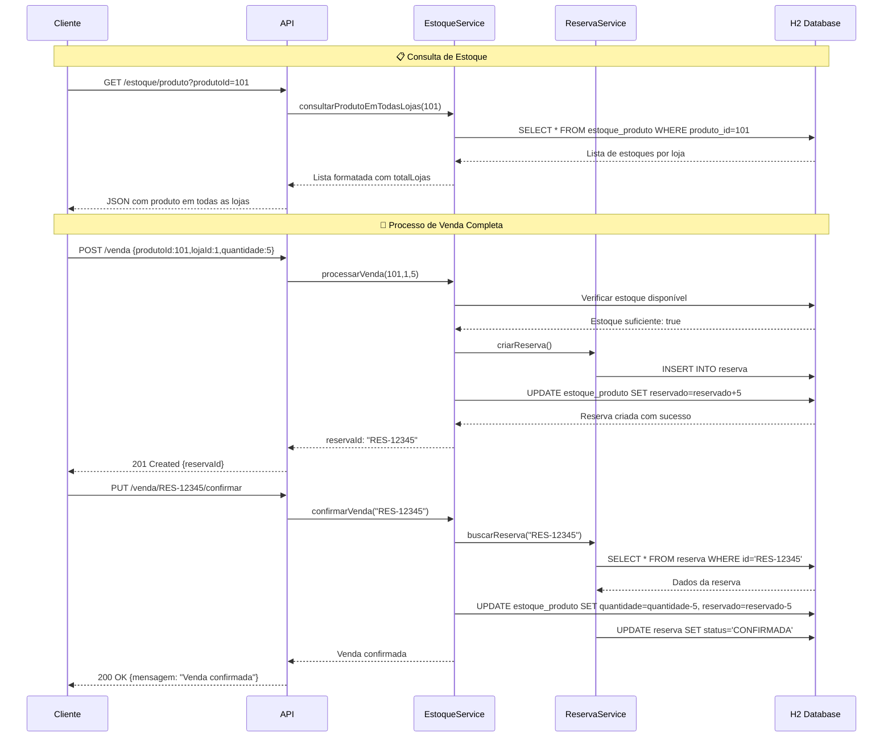
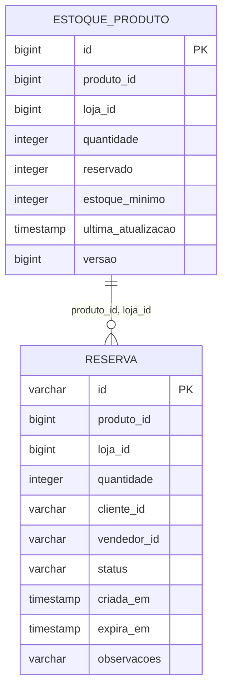
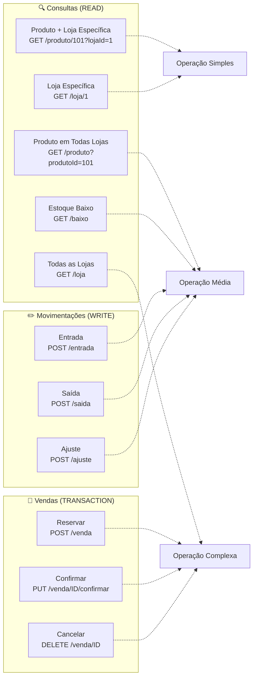
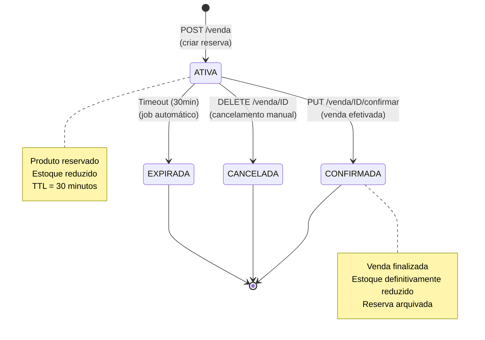
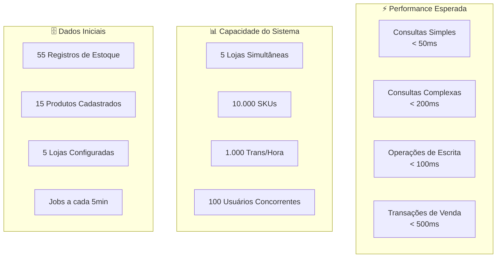
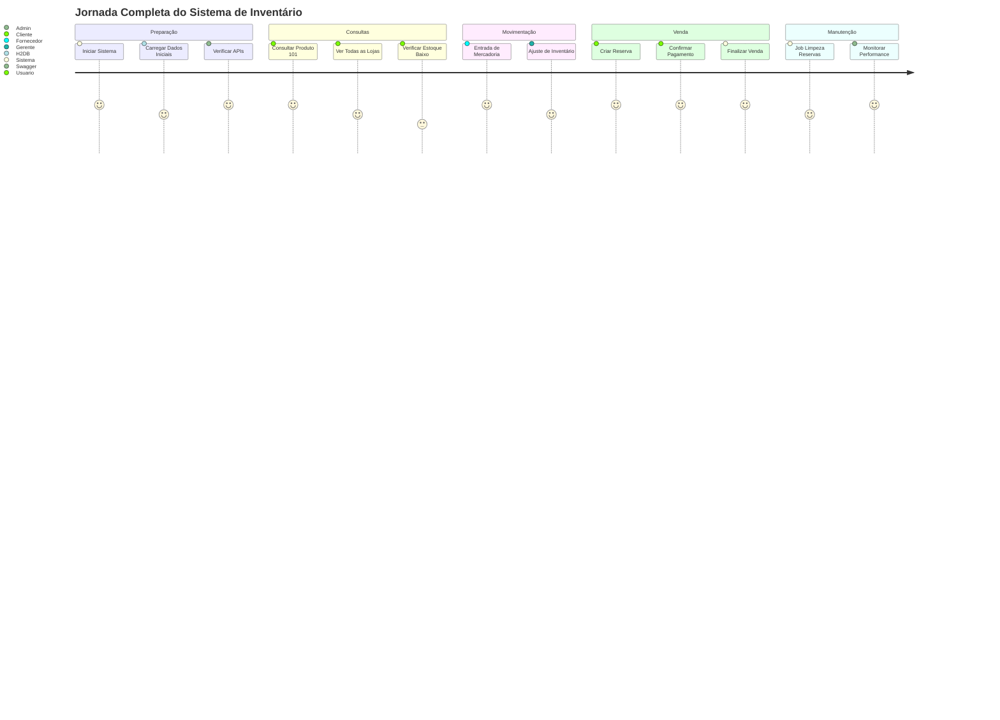

# 🌐 Diagrama Visual das APIs - Sistema de Inventário

## 📊 **Mapa Completo das APIs**

```mermaid
graph TB
    %% Estilo dos nós
    classDef apiGet fill:#e1f5fe,stroke:#01579b,stroke-width:2px
    classDef apiPost fill:#f3e5f5,stroke:#4a148c,stroke-width:2px
    classDef apiPut fill:#fff3e0,stroke:#e65100,stroke-width:2px
    classDef apiDelete fill:#ffebee,stroke:#b71c1c,stroke-width:2px
    classDef database fill:#e8f5e8,stroke:#2e7d32,stroke-width:2px
    classDef service fill:#fff9c4,stroke:#f57f17,stroke-width:2px

    %% Banco de Dados
    H2[(H2 Database<br/>inventorydb)]:::database

    %% Serviços
    EstoqueService[EstoqueServiceJpa<br/>Business Logic]:::service
    ReservaService[ReservaServiceJpa<br/>Business Logic]:::service

    %% APIs de Consulta - GET
    subgraph "📋 APIs de Consulta"
        GET1["GET /estoque/produto/{id}?lojaId={id}<br/>🔍 Produto em Loja Específica"]:::apiGet
        GET2["GET /estoque/produto?produtoId={id}<br/>🏪 Produto em Todas as Lojas"]:::apiGet
        GET3["GET /estoque/loja/{id}<br/>📦 Produtos de Uma Loja"]:::apiGet
        GET4["GET /estoque/loja<br/>🌐 Produtos de Todas as Lojas"]:::apiGet
        GET5["GET /estoque/baixo<br/>⚠️ Produtos com Estoque Baixo"]:::apiGet
    end

    %% APIs de Movimentação - POST
    subgraph "📦 APIs de Movimentação"
        POST1["POST /entrada<br/>📥 Entrada de Mercadoria"]:::apiPost
        POST2["POST /saida<br/>📤 Saída Manual"]:::apiPost
        POST3["POST /ajuste<br/>⚖️ Ajuste de Inventário"]:::apiPost
    end

    %% APIs de Venda - POST/PUT/DELETE
    subgraph "🛒 APIs de Venda"
        POST4["POST /venda<br/>🛍️ Criar Reserva de Venda"]:::apiPost
        PUT1["PUT /venda/{id}/confirmar<br/>✅ Confirmar Venda"]:::apiPut
        DELETE1["DELETE /venda/{id}<br/>❌ Cancelar Venda"]:::apiDelete
    end

    %% Fluxos de Dados
    GET1 --> EstoqueService
    GET2 --> EstoqueService
    GET3 --> EstoqueService
    GET4 --> EstoqueService
    GET5 --> EstoqueService

    POST1 --> EstoqueService
    POST2 --> EstoqueService
    POST3 --> EstoqueService

    POST4 --> EstoqueService
    POST4 --> ReservaService
    PUT1 --> EstoqueService
    PUT1 --> ReservaService
    DELETE1 --> EstoqueService
    DELETE1 --> ReservaService

    EstoqueService --> H2
    ReservaService --> H2
```

## 🔄 **Fluxo de Processos de Negócio**

## 🏗️ **Arquitetura de Dados**

## 📊 **Matriz de Operações por Endpoint**

## 🚦 **Estados e Transições de Reserva**

## 📈 **Performance e Volumetria**

## 🛠️ **Exemplo de Uso Completo**

---

## 🎯 **Resumo Visual**

Este diagrama Mermaid apresenta uma visão completa do sistema de inventário, incluindo:

- **13 endpoints** organizados por função
- **Fluxos de processo** com sequência de operações  
- **Modelo de dados** com relacionamentos
- **Estados de reserva** e transições
- **Métricas de performance** esperadas
- **Jornada do usuário** completa

O sistema está otimizado para **consistência**, **performance** e **facilidade de uso**, com APIs intuitivas e processos de negócio bem definidos.