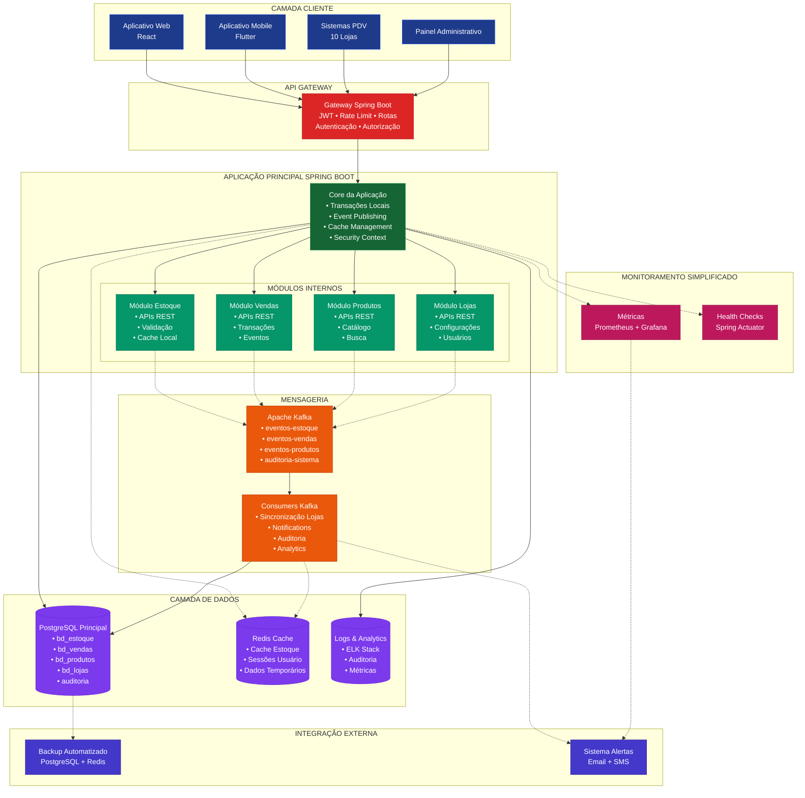

# Diagrama Mermaid - Arquitetura Simplificada

```mermaid
graph TB
    %% Cliente Layer
    subgraph "CAMADA CLIENTE"
        WEB[Aplicativo Web<br/>React]
        MOB[Aplicativo Mobile<br/>Flutter] 
        POS[Sistemas PDV<br/>10 Lojas]
        ADM[Painel Administrativo]
    end
    
    %% API Gateway
    subgraph "API GATEWAY"
        GW[Gateway Spring Boot<br/>JWT • Rate Limit • Rotas<br/>Autenticação • Autorização]
    end
    
    %% Main Application
    subgraph "APLICAÇÃO PRINCIPAL SPRING BOOT"
        subgraph "MÓDULOS INTERNOS"
            MOD_EST[Módulo Estoque<br/>• APIs REST<br/>• Validação<br/>• Cache Local]
            MOD_VEN[Módulo Vendas<br/>• APIs REST<br/>• Transações<br/>• Eventos]
            MOD_PRO[Módulo Produtos<br/>• APIs REST<br/>• Catálogo<br/>• Busca]
            MOD_LOJ[Módulo Lojas<br/>• APIs REST<br/>• Configurações<br/>• Usuários]
        end
        
        APP_CORE[Core da Aplicação<br/>• Transações Locais<br/>• Event Publishing<br/>• Cache Management<br/>• Security Context]
    end
    
    %% Event Streaming
    subgraph "MENSAGERIA"
        KAF[Apache Kafka<br/>• eventos-estoque<br/>• eventos-vendas<br/>• eventos-produtos<br/>• auditoria-sistema]
        
        CONSUMERS[Consumers Kafka<br/>• Sincronização Lojas<br/>• Notifications<br/>• Auditoria<br/>• Analytics]
    end
    
    %% Data Layer
    subgraph "CAMADA DE DADOS"
        PGMAIN[(PostgreSQL Principal<br/>• bd_estoque<br/>• bd_vendas<br/>• bd_produtos<br/>• bd_lojas<br/>• auditoria)]
        
        REDIS[(Redis Cache<br/>• Cache Estoque<br/>• Sessões Usuário<br/>• Dados Temporários)]
        
        LOGS[(Logs & Analytics<br/>• ELK Stack<br/>• Auditoria<br/>• Métricas)]
    end
    
    %% Monitoring
    subgraph "MONITORAMENTO SIMPLIFICADO"
        METRICS[Métricas<br/>Prometheus + Grafana]
        HEALTH[Health Checks<br/>Spring Actuator]
    end
    
    %% External Integration
    subgraph "INTEGRAÇÃO EXTERNA"
        BACKUP[Backup Automatizado<br/>PostgreSQL + Redis]
        ALERTS[Sistema Alertas<br/>Email + SMS]
    end
    
    %% Connections - Client to Gateway
    WEB --> GW
    MOB --> GW
    POS --> GW
    ADM --> GW
    
    %% Gateway to Application
    GW --> APP_CORE
    
    %% Application Core to Modules
    APP_CORE --> MOD_EST
    APP_CORE --> MOD_VEN
    APP_CORE --> MOD_PRO
    APP_CORE --> MOD_LOJ
    
    %% Modules to Kafka
    MOD_EST -.-> KAF
    MOD_VEN -.-> KAF
    MOD_PRO -.-> KAF
    MOD_LOJ -.-> KAF
    
    %% Kafka to Consumers
    KAF --> CONSUMERS
    
    %% Application to Databases
    APP_CORE --> PGMAIN
    APP_CORE -.-> REDIS
    
    %% Consumers to Databases
    CONSUMERS --> PGMAIN
    CONSUMERS -.-> REDIS
    
    %% Monitoring connections
    APP_CORE -.-> METRICS
    APP_CORE -.-> HEALTH
    APP_CORE --> LOGS
    
    %% External connections
    PGMAIN -.-> BACKUP
    CONSUMERS -.-> ALERTS
    METRICS -.-> ALERTS
    
    %% Styling - Cores com melhor contraste
    classDef client fill:#1e3a8a,stroke:#1d4ed8,color:#ffffff
    classDef gateway fill:#dc2626,stroke:#b91c1c,color:#ffffff
    classDef mainapp fill:#166534,stroke:#15803d,color:#ffffff
    classDef modules fill:#059669,stroke:#047857,color:#ffffff
    classDef messaging fill:#ea580c,stroke:#c2410c,color:#ffffff
    classDef data fill:#7c3aed,stroke:#6d28d9,color:#ffffff
    classDef monitoring fill:#be185d,stroke:#9d174d,color:#ffffff
    classDef external fill:#4338ca,stroke:#3730a3,color:#ffffff
    
    class WEB,MOB,POS,ADM client
    class GW gateway
    class APP_CORE mainapp
    class MOD_EST,MOD_VEN,MOD_PRO,MOD_LOJ modules
    class KAF,CONSUMERS messaging
    class PGMAIN,REDIS,LOGS data
    class METRICS,HEALTH monitoring
    class BACKUP,ALERTS external
```